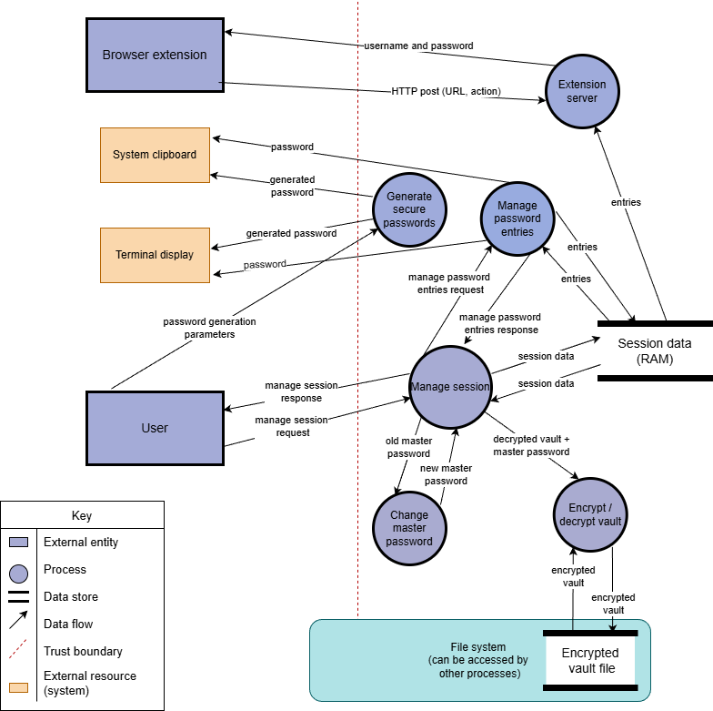

# DOCUMENTATION - PASSWORD MANAGER

## By group 4

Contents:
1. Application description
2. Features
3. Installation process
4. Testing
5. Threat model
6. Use of AI / LLM

### Application description

Password manager is a software that is installed locally on a stand-alone machine (not part of a network, no server needed), which manages the passwords for the local user of this machine. The user can manage different passwords for different applications in a central point. That means, that the user can define one or multiple encrypted files (called vault) where he can create / write / edit passwords for different applications and websites. 

### Features

The password manager offers the following features and capabilities for the user: 

**File creation**
-  The command "init" creates a new vault where the user stores passwords. It gives the user the option to select a name for the vault and allows him to initiate the process of creating a password file (vault).

How to use:
- The user can either use "init" by itself, and will be guided through the initialization, or use "init <vault_name>" to directly choose a name.

**Open a vault**
- The command "open" allows the user to open one of the existing vaults and access all passwords stored in this vault. The master password is needed to access this vault. 

How to use:
- The user can type "open <vault_name>", where <vault_name> is an existing vault. Then the user will be prompted to type the master password associated with this vault. 

**Close a vault**
- The command "close" allows the user to close an opened vault. This can only be used when a vault has already been successfully opened. 

How to use:
- The user can type "close" and then will be asked to confirm with "y" or "n". 

**List all existing vaults**
- The command "vaults" allows the user to get an overview of all existing vaults. 

**Edit a vault**
- The command "edit" allows the user to edit existing password entries in a vault and the associated information (including the entry name, the url, the username, the password and the notes). 

How to use:
- The user can type "edit <entry_name>" and will be guided through the process of changing the information related to that entry by typing the new entry_name/username/URL/notes/password or pressing enter to keep the current value. 

**Add a new password entry**
- The command "add" allows the user to add a new password entry. 

How to use:
- The user can type "add" to add a new entry OR the user can type “add <entry_name>” and then will be guided through the rest of the process automatically where he can define the entry name (if command "add" was used), the username, the url, the notes and the password.

**Delete a password entry**
- The command "delete", removes a password entry from the vault.

**Delete a vault**
- The command "deletevault" permanently deletes a vault. Due to RustPass’s logic, the vault must be opened in order to be able to delete it.

**List one password entry**
- The command "get" lets the user pick 1 entry to be shown. 

How to use:
- Get uses the currently open vault and requires the user to type the entryname with get: "get <entryname>". With this, the password will be censored. To show the password "get <entryname> -s(--show)" does the trick. Though, using -s does query the user to input the master password for the current vault for more security.

**List all password entries**
- The command "getall" allows the user to view all saved password entries in the currently opened vault.

**Generate a secure password**
- The command “generate” gives the user the option to generate a secure password for a password entry (NOT THE MASTER PASSWORD).

How to use:
- “Generate <length-of-generated-password>” 
- Generate <…> -f (--no-symbols) (to not include any symbols in the password)

**Change the master password**
- The command "changemaster" changes the master password.

**Clear the terminal**
- The command "clear" clears the terminal for a cleaner look.

**Exit the application**
- The command "quit" queries the user to confirm by using "y/n" and then terminates the application. By using "quit -f (--force)" the query can be skipped. 

### Installation process

### Testing 

### Threat model

**Summary:**
Total threats identified: 37

Critical risks: 3
- Brute force (online attack) - partially mitigated
- Memory dumps - partially mitigated
- Memory swapping - not mitigated

High risks: 6

Medium risks: 9

Low risks: 19

Key strengths:
- Cryptography (enc_file internally uses XChaCha20-Poly1305 and Argon2id)
- Password enforcement (zxcvbn)
- Clipboard auto-clear implemented

Residual risks (accepted):
- Memory dumps
- Social engineering (attacker tricks user into revealing master password, cannot be prevented by software)
- Backup security (encrypted vault backups may be stored insecurely)
- Physical access to unlocked sessions (auto-lock reduces risk but does not eliminate it)

**Assumptions:**
- Local single-user system
- OS is not compromised
- Attacker may access encrypted vault
- User only installs trusted browser extensions
- Browser is not compromised

**Data flow diagram (DFD):**

**Additional information about the DFD:**
- Session data includes decrypted vault, master password, lifetime of session 
- Session data lives in memory (RAM)
- File system is partially trusted as the application processes can read / write the encrypted vault file (.psdb format) and other processes can read it. 
- The trust boundary separates untrusted (user input, system resources) from trusted (application processes, session data).
- Authentication token is stored in browser's local storage as plaintext (outside application boundary)

**Information to understanding the following tables:**
- Risk is calculated as: Risk = Impact * Likelihood
- NA = Not Applicable
- NM = Not mitigated threat
- PM = Partially mitigated threat
- FM = Fully mitigated threat

**Applying STRIDE for each element in the data flow diagram.**

- Element: User

| STRIDE | Threat description | Risk level | Mitigation |
| ------ | ------------------ | ---------- | ---------- |
| Spoofing | NA | | |
| Tampering | NA | | |
| Repudiation | User can deny an action they did. E.g. user can delete entries and then deny it. | Low | NM - No audit log |
| Information Disclosure | NA | | |
| Denial of service | NA | | |
| Elevation of privilege | NA | | |

- Element: Manage Session

| STRIDE | Threat description | Risk level | Mitigation |
| ------ | ------------------ | ---------- | ---------- |
| Spoofing | Attacker can brute force authentication (online attack) | Critical | PM - Argon2id slows down (1 password guess = 100ms), zxcvbn ensures secure password. Improvement: Rate limiting and/or mandatory password rotation every 3 years |
| Spoofing | Attacker gets access to opened vault through unlocked session and opened terminal , allowing impersonation | High | PM - Auto-locking after user-configured inactivity (default 5 minutes). Re-authentication is required for sensitive operations |
| Tampering | User tries changing vault directory when prompting the vault name using "/" | Low | FM - Vault name only allowes alphanumeric characters + "-" +"_" | 
| Repudiation | NA | | |
| Information disclosure | Memory dumps reveal master password and decrypted vault | | See session data threats |
| Denial of service | Application could crash during save or end session | Medium | PM - AEAD detects corruption. Improvement: atomic file writes and backups |
| Elevation of privilege | NA | | |

- Element: Change master password

| STRIDE | Threat description | Risk level | Mitigation |
| ------ | ------------------ | ---------- | ---------- |
| Spoofing | NA | | |
| Tampering | Password change fails mid-operation, corrupting vault or making it inaccessible | High | PM - AEAD detects file corruption if it occurs. Improvement: make close_vault() atomic or create backup copy of vault in case application fails after existing file has been overwritten. |
| Repudiation | NA | | |
| Information disclosure | Old and new passwords are both in memory simultaneously | Medium | PM - SecretString will zeroize both eventually, both are stored briefly. Improvement: zeroize old immediately after verification |
| Denial of service | NA | | |
| Elevation of privilege | NA | | |

- Element: Encrypt / decrypt vault

| STRIDE | Threat description | Risk level | Mitigation |
| ------ | ------------------ | ---------- | ---------- |
| Spoofing | NA | | |
| Tampering | Weak encryption allows breaking | Low | FM - XChaCha20-Poly1305 |
| Repudiation | NA | | |
| Information disclosure | Master password is left in memory after use | Medium | NM - Depends on enc_file implementation (residual risk) |
| Denial of service | NA | | |
| Elevation of privilege | NA | | |

- Element: Manage password entries 

| STRIDE | Threat description | Risk level | Mitigation |
| ------ | ------------------ | ---------- | ---------- |
| Spoofing | NA | | |
| Tampering | Duplicate entry names can cause confusion | Low | FM - Validation is present |
| Repudiation | Entry modifications are not logged | Low | NM - Improvement: audit log |
| Information disclosure | NA | | |
| Denial of service | Extremely large entries can crash the application | Low | NM - Improvement: size validation |
|Elevation of privilege | NA | | |

- Element: generate secure passwords 

| STRIDE | Threat description | Risk level | Mitigation |
| ------ | ------------------ | ---------- | ---------- |
| Spoofing | NA | | |
| Tampering | Weak RNG produces predictable passwords | Low | FM - passgenr crate uses cryptographically secure RNG |
| Repudiation | NA | | |
| Information disclosure | Generated passwords are immediately copied to clipboard and shown on terminal | High | NM - Improvement: User chooses whether to see password or only copy to clipboard |
| Denial of service | NA | | |
| Elevation of privilege | NA | | |

- Element: Session data

| STRIDE | Threat description | Risk level | Mitigation |
| ------ | ------------------ | ---------- | ---------- |
| Spoofing | NA | | |
| Tampering | NA | | |
| Repudiation | NA | | | 
| Information Disclosure | Memory dump exposes entire decrypted vault | Critical | PM - Master password protected through SecretString, 5-min timeout reduces exposure window. Residual risk: application cannot prevent OS-level memory operations |
| Information disclosure | Memory paged to swap file on disk | Critical | NM - Improvement: mlock to prevent swapping (platform dependent) |
| Denial of service | NA | | |
| Elevation of privilege | NA | | |

- Element: encrypted vault file

| STRIDE | Threat description | Risk level | Mitigation |
| ------ | ------------------ | ---------- | ---------- |
| Spoofing | NA | | |
| Tampering | Attacker modifies encrypted file | Medium | FM - Encryption algorithm detects tampering |
| Repudiation | NA | | |
| Information disclosure | File is backed up to insecure location | Medium | NM - Improvement: document security of backup locations | 
| Information disclosure | File left on disk after deletion | Low | PM - Normal delete, will eventually be overwritten when space is reused, vault is still encrypted. Improvement: secure wipe option |
| Information disclosure | Attacker steals vault file and attempts offline brute force | Medium | PM - Argon2id and zxcvbn make brute force take years |
| Denial of service | File is deleted or corrupted | High | NM - Improvement: automatic backups, versioning |
| Denial of service | A full disk prevents saving | Medium | PM - Error handling. Improvement: check space before write | 
| Elevation of privilege | NA | | |

- Element: system clipboard 

| STRIDE | Threat description | Risk level | Mitigation |
| ------ | ------------------ | ---------- | ---------- |
| Spoofing | NA | | | 
| Tampering | Malicious process could modify clipboard content before user pastes | Medium | NM - Improvement: warn users to verify pasted content | 
| Repudiation | NA | | |
| Information disclosure | Any process can read clipboard, passwords persist indefinitely | Low | FM - Auto-clear clipboard after 30 seconds | 
| Denial of service | Clipboard is unavailable or full | Low | FM - error handling |
| Elevation of privilege | NA | | |

- Element: terminal display

| STRIDE | Threat description | Risk level | Mitigation |
| ------ | ------------------ | ---------- | ---------- |
| Spoofing | NA | | |
| Tampering | NA | | |
| Repudiation | NA | | |
| Information disclosure | Passwords are visible on screen, risk of shoulder surfing | High | PM - User can use --copy flag to avoid displaying password. Clipboard is cleared after 30 seconds | 
| Information disclosure | Terminal history captures passwords | High | NM - Improvement: disable history for password inputs | 
| Denial of service | NA | | |
| Elevation of privilege | NA | | |

- Element: browser extension

| STRIDE | Threat description | Risk level | Mitigation |
| ------ | ------------------ | ---------- | ---------- |
| Spoofing | Attacker forges request with stolen token | Low | PM - Token validation required for all requests, only works during active 5-minute sessions. |
| Tampering | NA | | |
| Repudiation | NA | | |
| Information disclosure | Extension fills credentials into fake login form on legitimate website. | Low | PM - username and password are only copied if the URL matches and the correct token is provided. Reality: requires attacker to compromise legitimate website (out of scope) |
| Information disclosure | Passwords are sent over HTTP (not HTTPS) to localhost | Low | FM - Localhost-only (no network exposure) eliminates network sniffing risk.  |
| Information disclosure | Token stored in browser local storage as plaintext. Any browser extension can read local storage | Medium | NM - Assumes user has no malicious extensions. Improvement: Document this risk to users |
| Information disclosure | Token is visible in terminal at startup | Low | NM - Token must be displayed for user to copy to extension. Reality: if attacker sees terminal, they can see more sensitive data |
| Denial of service | Port 9123 in use prevents server from starting | Low | PM - Error handling |
| Elevation of privilege | Extension bypasses CLI authentication | Low | FM - requires active session to operate |

- Element: extension server 

| STRIDE | Threat description | Risk level | Mitigation |
| ------ | ------------------ | ---------- | ---------- |
| Spoofing | Malicious local process can send requests, imitating a legitimate website with stolen or guessed token | Low | PM - Token validation prevents unauthorized access. Residual risk: OS has been compromised |
| Tampering | NA | | |
| Repudiation | NA | | |
| Information disclosure | Extension server exposes entries to any process with valid token | Low | PM - Token required, localhost only, active session required. |
| Denial of service | Rapid requests spawn unlimited threads | Low | NM - Improvement: rate limiting|
| Elevation of privilege | NA | | |
